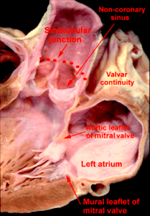

**Objective:**\
Train and validate a detection model to regress the coordinates of fifteen aortic landmarks from cardiac Computed Tomography (CT) scans
<!--more-->

**Background**\
There exist several distinct architectures for landmark detection task. 

    

        
        
    

    

        Aortic Root Anatomy   
    

**Methods**\
..

**Result**\
..

**Discussion**\
..

**References**\
..

**References**\
[1] Nagpal, Prashant & Agrawal, Mukta & Saboo, Sachin & Hedgire, Sandeep & Priya, Sarv & Steigner, Michael. (2020). Imaging of the aortic root on high-pitch non-gated and ECG-gated CT: awareness is the key!. Insights into Imaging. 11. 10.1186/s13244-020-00855-w.
 
[2] Anderson RHClinical anatomy of the aortic rootHeart 2000;84:670-673. 

