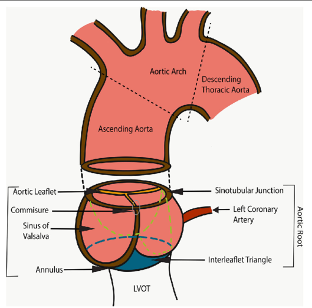

**Objective:**\
Train and validate a detection model to regress the coordinates of fifteen aortic landmarks from cardiac Computed Tomography (CT) scans
<!--more-->

**Background**\
There exist several distinct architectures for landmark detection task.

**Methods**\
..

**Result**\
..

**Discussion**\
..

