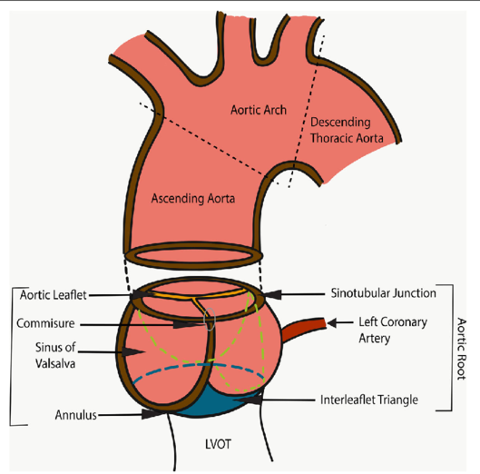
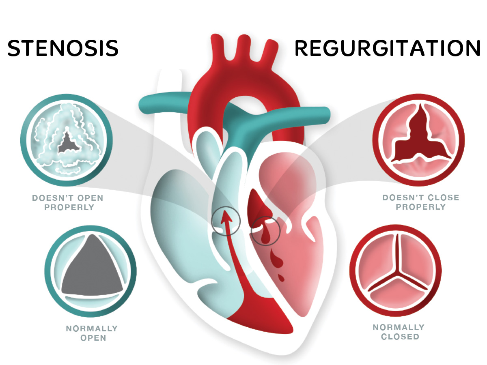
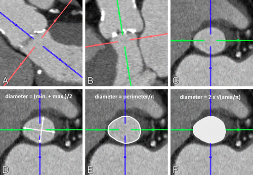
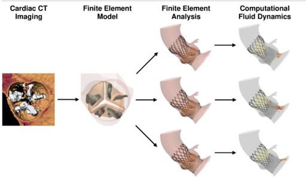
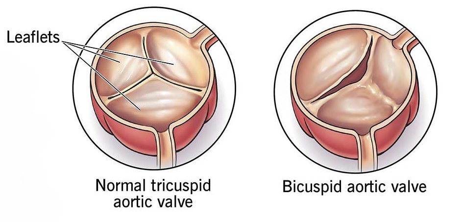
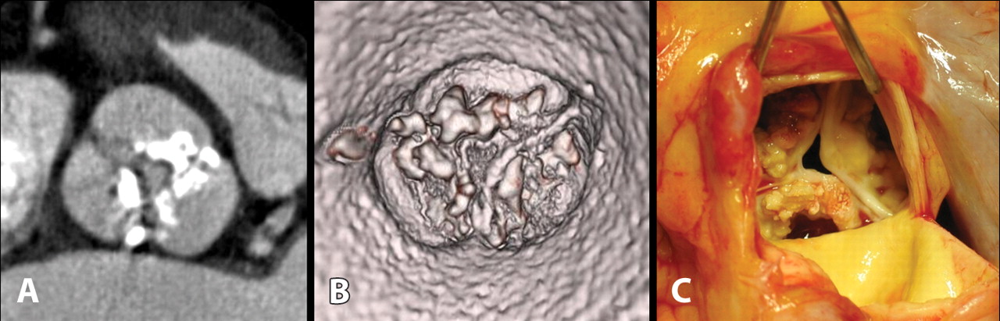
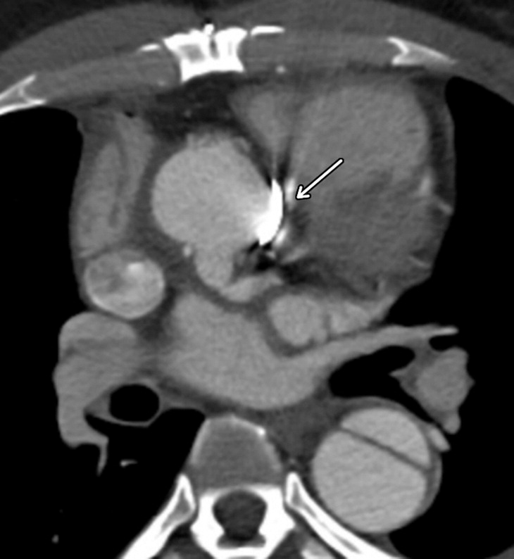
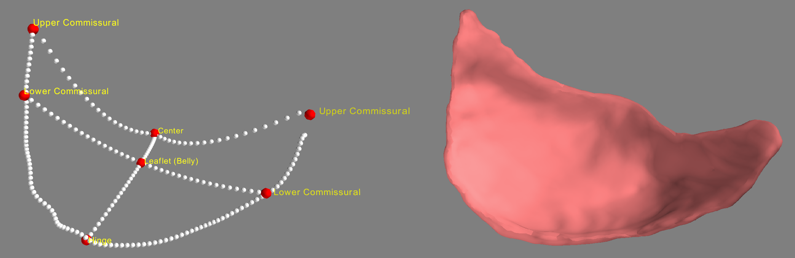
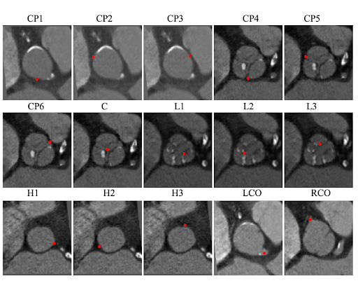

**Objective:**\
Develop a robust segmentation algorithm to create an accurate reconstruction of aortic valve using cardiac Computed Tomography (CT) scans
<!--more-->
 

### **Clinical Background**
Typically presenting as a tri-leaflet structure, the aortic valve is a unidirectional valve located in the aortic root, the section of the aorta (the largest artery in the human body) that attaches to the heart.
The aortic root consists of multiple structural components that function together to maintain the body's optimal blood flow. 
You can appreciate the complex anatomy of the root in Figure 1, where the schematic (left) delineates the main structures of root alongside an actual photo of the anatomy (right). 

    

        
        
    

    

        <b> Figure 1: </b>  Aortic Root Anatomy   
    

 

The geometric properties of the delineated structures such as the annulus, sinotubular junction, and the sinus of Valsalva are all carefully considered in clinical procedures for treating valvular diseases.
There are two main types structural valvular disease: **Regurgitation and Stenosis**. Figure 2 illustrates the structural mechanisms of the two types. Regurgitation (insufficiency) refers to a condition where the valve does not close completely, leading to a backward 
flow of blood. Stenosis is a condition where the opening of the valve narrows typically as the aortic leaflet thickens and/or becomes calcified, hindering the heart's ability to pump blood effectively. The focus of this project and its motivation is aortic stenosis and
its treatments.

    

        
    

    

        <b>Figure 2:</b> Valvular Disease: Stenosis and Regurgitation 
    
 

 

The most common treatment options for aortic stenosis include surgical aortic valve replacement (**SAVR**) and transcather aortic valve replacement (**TAVR** or **TAVI**). Transcather aortic valve replacement 
is a non-invasive alternative procedure typically recommended for patients with higher surgical risk level. While SAVR involves an open-heart surgery for the doctor to manually excise and replace the diseased valve with
a new prosthetic valve, TAVR delivers a TAVR-specific prosthetic valve through a catheter that is inserted through a blood vessel (i.e. femoral artery). The following video effectively demonstrates the TAVR procedure.



    <b>TAVR Procedure</b> 

 
 

In both SAVR and TAVR, the clinical pre-procedural planning based on CT images plays a critical role in minimizing the chances of adverse events such as coronary obstruction, which can be critical for patient outcome. 
Specifically, CT-based clinical measurements of aortic structures like the aortic annulus remains the gold standard for pre-procedural planning of TAVR. 
More recently, 3D reconstruction of the aortic root has been used for computational fluid dynamics (CFD) simulation of the blood flow through the anatomy to understand the hemodynamics and potentially predict the procedural outcome, 
showing that patient-specific simulations of the TAVR procedure can be effectively utilized to minimize procedural risks.

    

        <figure style="width: 48%; margin: 0;">
            
            <figcaption style="margin-top: 4px; font-size: 0.85em; color: #999;">
                <b>Figure 3:</b> Clinical measurements of aortic structures for pre-procedural planning
            </figcaption>
        </figure>
        <figure style="width: 48%; margin: 0;">
            
            <figcaption style="margin-top: 4px; font-size: 0.85em; color: #999;">
                <b>Figure 4:</b> Computational fluid dynamics (CFD) simulations predicting TAVR outcomes
            </figcaption>
        </figure>
    

Both processes of extracting clinical measurements and 3D reconstruction involve the segmentation of the complex aortic root anatomy.
However, manual segmentation of an individual’s aortic root is a demanding and time-consuming task. 
Therein lies the goal of this project: **an automatic method to reconstruct the aortic valve from CT scans to enable a more efficient pipeline for a pre-procedural planning of aortic stenosis treatment.**

### **Methods**
In CT images, aortic leaflets can look vastly different from one another due to anatomical and acquisition variability:  
* Leaflet fusion: leaflets of some individuals are fused together as one (uni-cuspid) or two (bicuspid) leaflets, leading to a diminished valve function.

    

        
    

    

        <b>Figure 5</b>: Bicuspid Aortic Valve    
    
 

 

* Calcification: the severity of leaflet calcification can vary drastically. The spatial distribution and densities of calcium nodules play a crucial role in determining valve functions and TAVR planning.

    

        
    

    

        <b>Figure 6</b>: Calcified Aortic Valve    
    
 

 

* CT scanner/image quality: depending on the CT scanner type and manufacturer, CT images of aortic valves can be visually distinct. Specifically, scans of patients with metallic objects such as stents can contain artifacts that obscure the view of the valve.

    

        
    

    

        <b>Figure 7</b>: Example of CT artifact (arrow)   
    
 

 

An effective segmentation algorithm must account for such vast heterogeneity to robustly generalize across different populations. One could potentially  
train or finetune a deep learning model to segment the aortic valve end-to-end from CT images. However, as is with many medical applications, data (especially image data) are expensive. 
Furthermore, the vast variability in the patient population would need to be reflected in the dataset for the method to be robust. In such cases, incorporating domain knowledge and breaking up the task
as smaller tasks can be effective. One way to simplify this task is to utilize the structural consistency of the aortic valve. Despite the variability within the finer details
of the leaflets' phenotype (thickness, calcification, etc.), leaflets can be generalized using common landmarks to form a generalized structure. Figure 8 displays a generalized surface representation
of an aortic valve that is constructed from 7 landmarks: 4 commissural points (2 upper and 2 lower) that define the connection between the leaflet and the aortic root wall, 1 center point that determines the coaptation point
of the three leaflets, 1 leaflet point at the belly region of the leaflet, and 1 hinge point that determines the nethermost point of the leaflet. 

    

        
    

    

        <b>Figure 8:</b> Aortic Surface Model   (left: surface representation, right: 3D Segmentation)  
    
 

 

    

        
    

    

        <b>Figure 9:</b> Aortic Landmarks    CP: Commissural points, C: Center point, L: Leaflet points,   H: Hinge points, LCO: Left coronary ostium, RCO: Right coronary ostium   
    
 

 

 

### **Result**
A pipeline involving a landmark detection module and a point cloud registration module is developed. 

 

### **Discussion**
This method utilizes both the structural information obtained from the aortic landmarks and the intensity signal from the CT images to robustly segment the complex anatomy of the aortic valve. 

 
 
 

### **References**
[1] Nagpal, Prashant & Agrawal, Mukta & Saboo, Sachin & Hedgire, Sandeep & Priya, Sarv & Steigner, Michael. (2020). Imaging of the aortic root on high-pitch non-gated and ECG-gated CT: awareness is the key!. Insights into Imaging. 11. 10.1186/s13244-020-00855-w.  
 
[2] Anderson RHClinical anatomy of the aortic rootHeart 2000;84:670-673.  

[3] Heart valve disease. Heart Foundation NZ. (n.d.). https://www.heartfoundation.org.nz/your-heart/heart-conditions/heart-valve-disease.  

[4] UC Davis Health. (2019, December 2). Transcatheter aortic valve replacement (TAVR) [Video]. YouTube. https://www.youtube.com/watch?v=HKTeAOiByLw.  

[5] Ribeiro, Henrique B., John G. Webb, Raj R. Makkar, Mauricio G. Cohen, Samir R. Kapadia, Susheel Kodali, Corrado Tamburino, et al. "Predictive Factors, Management, and Clinical Outcomes of Coronary Obstruction Following Transcatheter Aortic Valve Implantation." Journal of the American College of Cardiology. 62, no. 17 (2013): 1552-62. https://doi.org/10.1016/j.jacc.2013.07.040.    

[6] Hellmeier, Florian, Jan Brüning, Simon Sündermann, Lina Jarmatz, Marie Schafstedde, Leonid Goubergrits, Titus Kühne, and Sarah Nordmeyer. "Hemodynamic Modeling of Biological Aortic Valve Replacement Using
Preoperative Data Only." Frontiers in cardiovascular medicine 7 (2021). https://doi.org/10.3389/fcvm.2020.593709.  

[7] Blanke, Philipp, Jonathan R. Weir-McCall, Stephan Achenbach, Victoria Delgado, Jörg Hausleiter, Hasan Jilaihawi, Mohamed Marwan, et al. "Computed Tomography Imaging in the Context of Transcatheter Aortic Valve Implantation (Tavi)/Transcatheter Aortic Valve Replacement (Tavr): An Expert Consensus Document of the Society of cardiovascular Computed Tomography." JACC.
Cardiovascular imaging 12, no. 1 (2019): 1-24. https://doi.org/10.1016/j.jcmg.2018.12.003. 

[8] Cleveland Clinic. “Bicuspid Aortic Valve Disease (BAVD) | Cleveland Clinic.” Cleveland Clinic, my.clevelandclinic.org/health/diseases/16780-bicuspid-aortic-valve-disease. Accessed 12 Aug. 2024. 

[9] Tanaka R, Yoshioka K, Niinuma H, Ohsawa S, Okabayashi H, Ehara S (2010) Diagnostic value of cardiac CT in the evaluation of bicuspid aortic stenosis: comparison with echocardiography and operative findings. AJR Am J Roentgenol 195(4):895–899. https://doi.org/10.2214/AJR.09.3164.  

[10] Kalisz, K., Buethe, J., Saboo, S. S., Abbara, S., Halliburton, S., & Rajiah, P. (2016). Artifacts at Cardiac CT: Physics and Solutions. Radiographics : a review publication of the Radiological Society of North America, Inc, 36(7), 2064–2083. https://doi.org/10.1148/rg.2016160079. 

[11] 